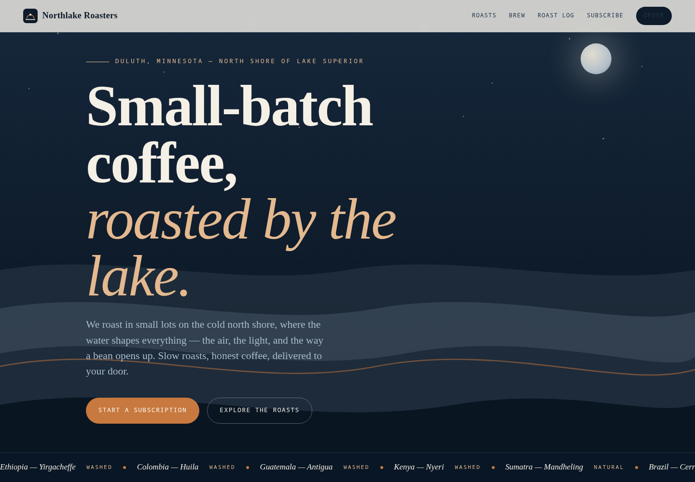
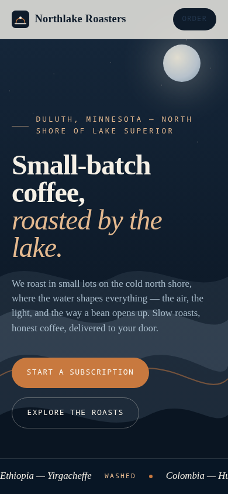

# Disco release artifacts

Public distribution files for Disco: reviewed source snapshots, container-install files, benchmark sources and evidence, and launch materials. The development repository and its history remain private.

## Built with Disco

**A coffee-company site built with Disco: Northlake Roasters**, on the North Shore of Lake Superior.

| Desktop | Phone |
|---|---|
|  |  |

[See the full coffee-company page](docs/assets/showcase/northlake/full.png).

## Benchmarks

[Benchmark source and evidence repository](https://github.com/Dyluhn/disco-releases) ·
[Download the benchmark release](https://github.com/Dyluhn/disco-releases/releases/tag/benchmarks-2026-09-21) ·
[Methodology and score-audit instructions](https://agenticdisco.pages.dev/docs/benchmarks)

### DeepResearch Bench — ten-task local comparison

| System | Report quality (RACE) | Supported citations per report | Citation accuracy (FACT) |
|---|---:|---:|---:|
| Claude Research (Opus 4.7) | 52.4 | 17 | 92.3% |
| Gemini Deep Research (Gemini 3.8 Flash) | 51.7 | 57 | 52.8% |
| **Disco (Qwen3.8 Flash Next)** | **50.9** | **117** | **70.5%** |
| Perplexity Deep Research | 46.9 | 56 | 65.1% |

One run per system per task, scored by an equal-weight panel of four judges.
RACE measures report quality relative to a human-written reference (50 = parity).
FACT measures citation support in retrieved source text, not whether a claim is
true. These ten tasks are a local reproduction of
[DeepResearch Bench](https://github.com/Ayanami0730/deep_research_bench), not the
100-task leaderboard; the scores are not comparable to its published rankings.

### App-Bench — six-task local comparison

| System | Verified rubric items |
|---|---:|
| Codex CLI 0.154.0 | 89.7% |
| **Disco** | **77.9%** |
| OpenHands 1.16.0 | 38.2% |
| Dyad 1.16.0 | 0% |

All four systems used DeepSeek V4 Flash (July 31 release), the same frozen
prompts and offline reference packs, a registry/model-only network, and a
two-hour cap. Each app had one build attempt and one blind grader. Scores cover
136 of 151 rubric items: an item unverified for any system was excluded for all
systems on that task. This is a local comparison, not an official App-Bench
score. Deployment and grading exceptions are documented in the fairness report.

The [benchmark release](https://github.com/Dyluhn/disco-releases/releases/tag/benchmarks-2026-09-21)
includes frozen tasks, harness and grading code, item-level results, all 24
App-Bench generated application source archives, and the full published
DeepResearch evidence. The compact source bundle includes `verify_scores.py`
to recompute the App-Bench totals. Read the included methodology, fairness
disclosures, redaction ledgers, and checksum manifests alongside the results.

## Application release

The [Disco v0.2.0 source and launch artifacts](https://github.com/Dyluhn/disco-releases/releases/tag/v0.2.0) are published from source commit `e06ad0eb3e65576d80b406c7ac191562051f0c93`. The prerelease includes a source archive, Compose files, frontend build, validation results, and launch video. Native amd64 images are built and locally tested; registry uploads and anonymous image-pull verification are still pending. Build locally from the source archive using its Compose build override.

The public repository commit identifies distribution documentation. The source archive and image metadata identify the actual Disco source commit.

## License and provenance

Disco source is Apache-2.0. Benchmark tasks, copied vendor/reference documents, and third-party evidence retain upstream authorship and terms. The Apache license in this repository does not relicense those materials.

## Reference documentation

The [self-host reference](docs/self-host.md), [capability overview](docs/overview.md), and [source README](SOURCE-README.md) are based on the reviewed source snapshot, with archive-based installation links for public distribution. Historical source documentation may describe planned multi-architecture registry publishing; consult the release notes for the actual published architectures and availability. Some governance checks require the development Git history, which is not part of the source archive.
