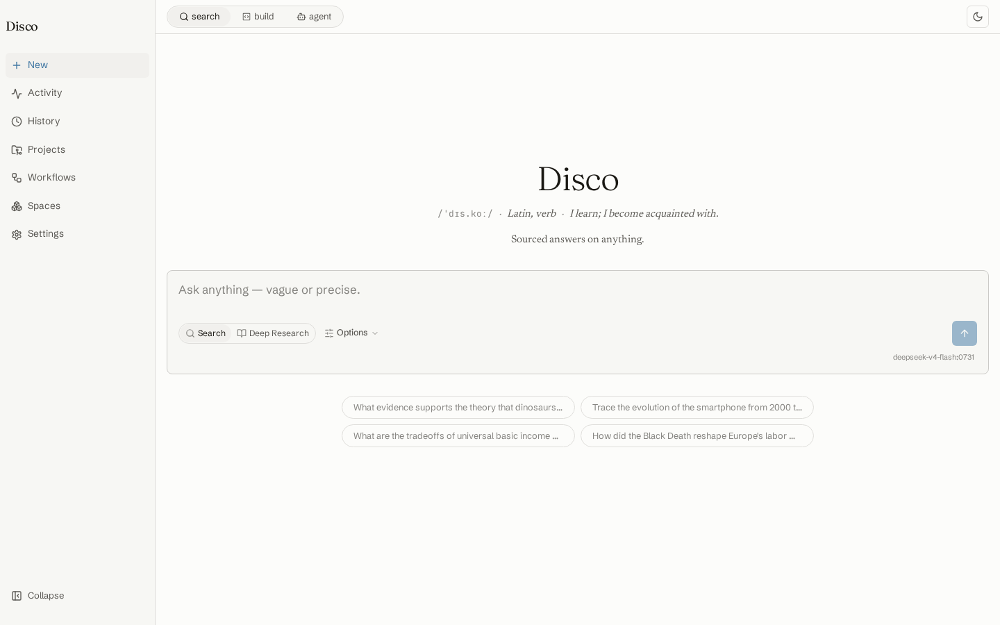
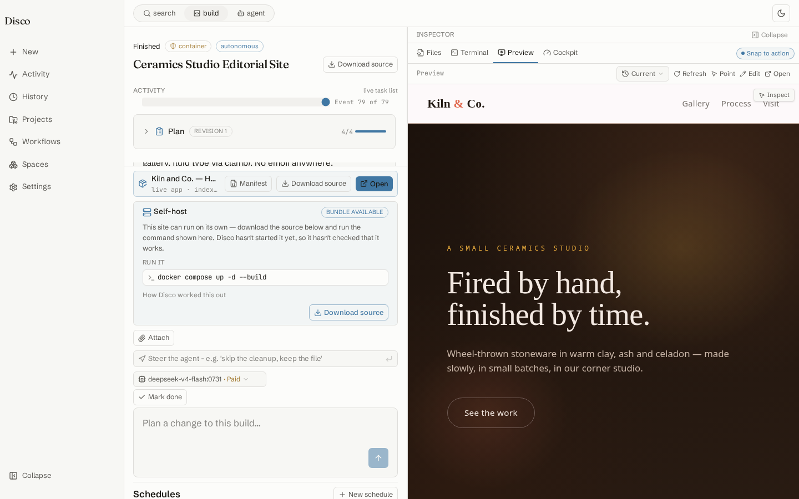
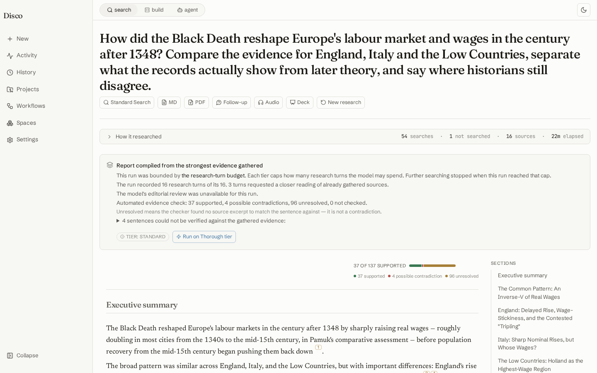
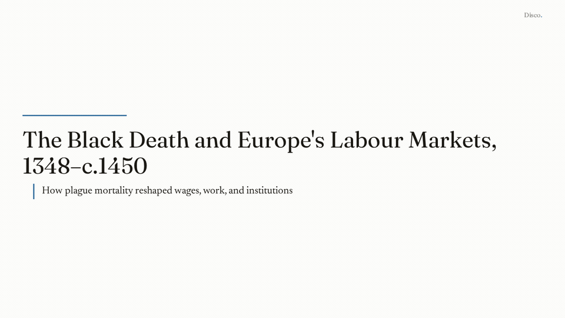
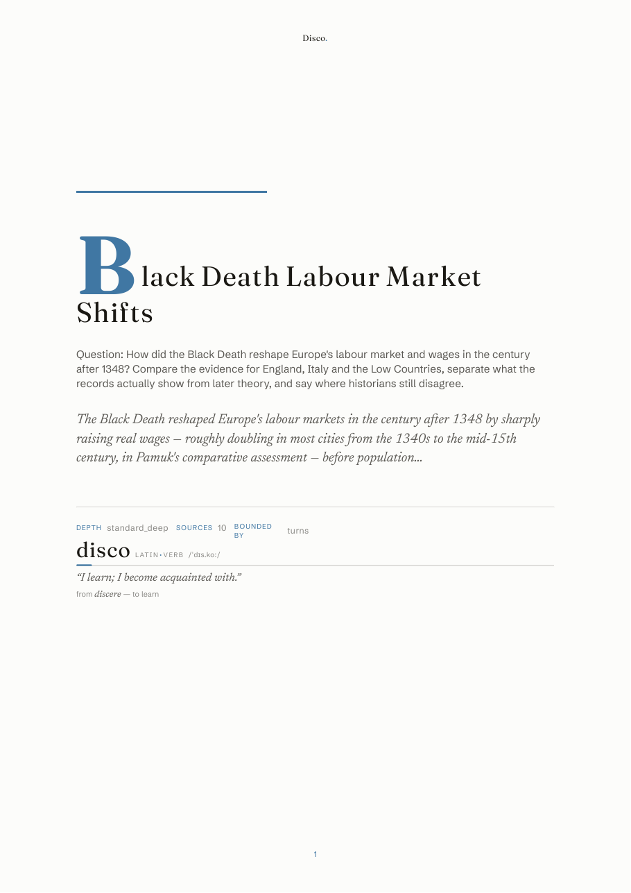
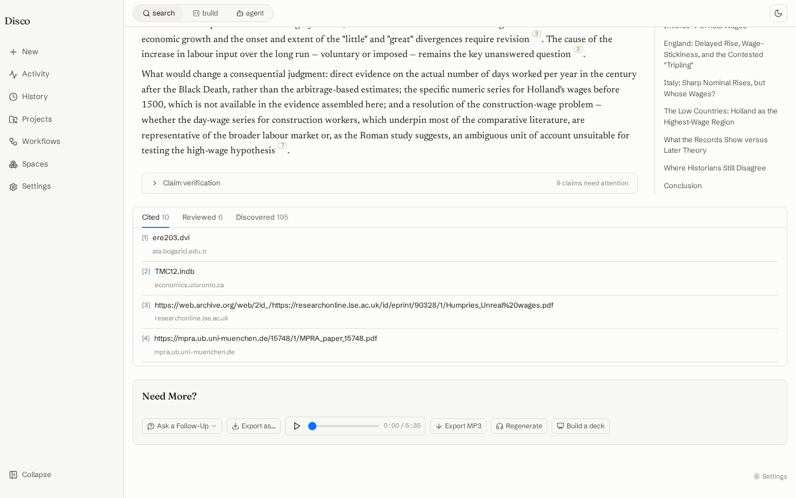
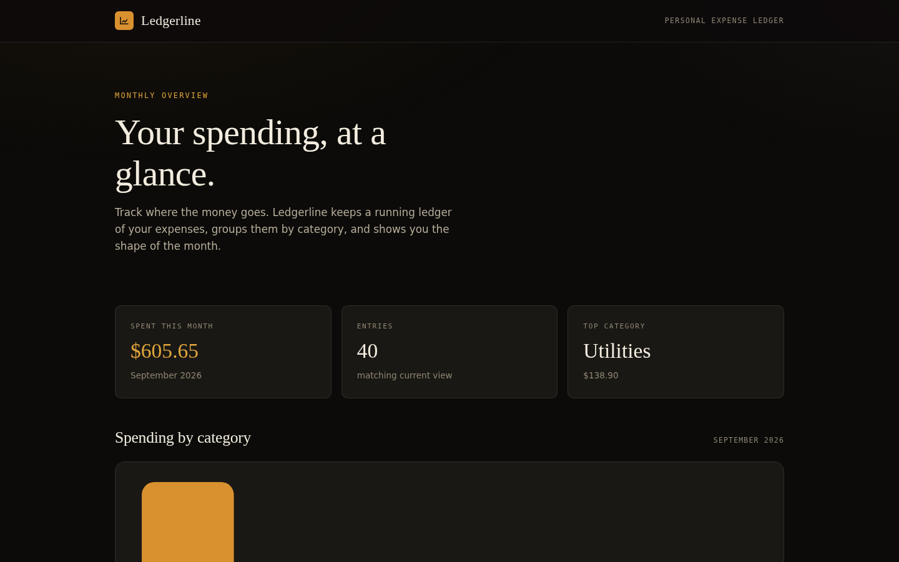
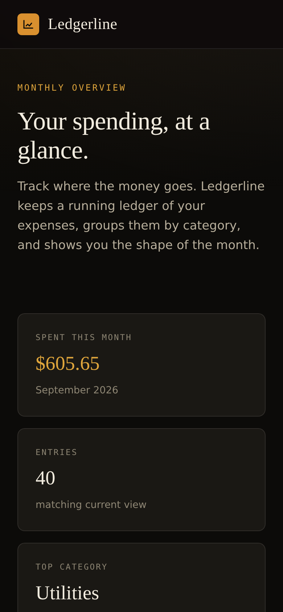

<p align="center">
  <picture>
    <source media="(prefers-color-scheme: dark)" srcset="docs/assets/logo-dark.svg">
    
  </picture>
</p>

# Disco

A self-hosted **Research + Agent + Build** platform: a grounded answer engine, a
deep-research report writer, and a sandboxed build agent on one append-only event
log. Built to run with local or open-weight models, not only frontier APIs.

Design authorities, when code and prose disagree:
[`basis-of-design.md`](./docs/contracts/basis-of-design.md) and
[`event-state-contract.md`](./docs/contracts/event-state-contract.md).

## Quickstart

Linux or WSL2 host (amd64 or arm64), rootless Podman, a compose provider. No
Python, Node or `uv` on the host; the stack pulls the published images (about
5 GB the first time).

```bash
sudo apt-get update && sudo apt-get install -y git podman docker-compose   # Debian 13
# Ubuntu 24.04: ... git podman podman-compose
git clone https://github.com/Dyluhn/disco.git
cd disco
systemctl --user daemon-reload
systemctl --user start dbus.socket
loginctl enable-linger "$USER"
systemctl --user enable --now podman.socket
export DISCO_SANDBOX_SOCKET=$XDG_RUNTIME_DIR/podman/podman.sock
podman compose up -d
podman ps --format '{{.Names}} {{.Status}}'      # three containers Up (healthy)
```

Open **http://localhost:8088**. A browser on the same machine pairs itself; if it
asks for a token, print it with
`podman compose exec app-server python -m disco.app_server.pairing_cli`.
Then add a driver model in **Settings → Models & Providers** and prove it:

```bash
podman compose exec agent-server disco-verify --quick
```

[`docs/self-host.md`](./docs/self-host.md) has the rest: the rootless Docker
path, what each compose provider prints, the headless (no browser) provider
setup, updating, starting at boot, backups, models and hardware. Something not
working? [`docs/troubleshooting.md`](./docs/troubleshooting.md) starts with one
command that says what is wrong.

## What it looks like

| Search and Deep Research | A finished Build, with its live preview |
|---|---|
|  |  |

**A Deep Research report** — how the Black Death reshaped Europe's labour market: 54
searches, 16 sources, every sentence checked against the evidence (37 of 137 supported,
the rest marked, never hidden). [Dark theme](docs/assets/screenshots/research-report-dark.png).



**From that report, without leaving the page:** a slide deck, a print-ready PDF, and a
spoken overview.



| [PDF export](docs/assets/showcase/black-death-labour-markets.pdf) | [Single-voice audio overview](docs/assets/showcase/audio-overview-clip.mp3) (5:35; first minute) |
|---|---|
|  |  |

**An app the Build agent made, shipped as a compose stack.** One paragraph asked for
Ledgerline, a personal expense tracker: a FastAPI + SQLite API, a React/Vite/TypeScript
front end served by nginx with `/api` proxied, two services and a named volume. The
downloaded source was brought up on a fresh VM with nothing but
`docker compose up -d --build`; these are captures of that running stack, not of a preview.

| Dashboard on the running stack | Phone |
|---|---|
|  |  |

[The whole page](docs/assets/showcase/ledgerline/dashboard-full.png) ·
[`docker-compose.yml`](docs/assets/showcase/ledgerline/docker-compose.yml) ·
[the README it wrote](docs/assets/showcase/ledgerline/README.md) ·
[the agent verifying its own form in a browser mid-build](docs/assets/showcase/ledgerline/agent-verifying-the-form.png).
A static site from one paragraph, for contrast: [a ceramics studio](docs/assets/screenshots/site-kiln-full.jpg).

Every capture is from a stock install on a fresh VM at the commit that shipped it; the
deck is also exported as [PowerPoint](docs/assets/showcase/black-death-labour-markets.pptx).

## Surfaces

| Surface | What it does |
|---|---|
| **Search** | One grounded answer — claims tethered to extracted passages, with a citation-verification pass that marks unsupported claims instead of hiding them. |
| **Deep Research** | A multi-source report: investigation plan → adaptive search/read/gap loop → evidence-led outline → cited synthesis and claim verification; depth tiers, replay, export (Markdown / PDF / DOCX), audio overview, slide deck. |
| **Build** | A coding agent in a sandbox: shell sessions, dev-server preview, browser automation, a persistent IPython kernel, artifacts, plan + risk-gated execution, workspace versions and rollback. |
| **Agent** | The same machinery as Build, framed as a general task agent; extend it with MCP servers. |

What is live in each, and the known limits: [`docs/overview.md`](./docs/overview.md).

## Layout

```
.
├── packages/        uv workspace: core → tools/retrieval → agent-server → app-server
├── frontend/        Vite/React/TS web UI
├── deploy/          compose and sandbox images
├── integrations/    messaging integrations
├── prompts/         prompt assets
├── docs/            user docs: self-host, overview, contracts/, architecture.generated.md
├── development/     architecture authorities, gate scripts, governance, harness, tests, notes
├── compose.yaml · pyproject.toml · uv.lock · Makefile
```

Dependency direction is one way, `core → tools → agent-server → app-server`, and
`disco` is a PEP 420 namespace package shared by every member.

## Develop

Requires [uv](https://docs.astral.sh/uv/), Python 3.12+, Node 22. To run the
stack from your checkout instead of the published images:

```bash
podman compose -f compose.yaml -f compose.build.yaml up -d --build
```

```bash
uv sync --all-packages
uv run pytest -m "not integration"
uv run ruff check packages development/harness
uv run basedpyright
cd frontend && npm ci && npm run typecheck:build && npm run build && npm test
```

`make test` is the fast hermetic gate. The contributor guide, the monorepo
layering rule, and the maintainer landing procedure are in
[`CONTRIBUTING.md`](./CONTRIBUTING.md); the governance model (sealed
authorities, the twelve gates) is under [`development/governance/`](./development/governance/README.md).
Deep Research runs can be injected, replayed and inspected with the
[outside-observer harness](./development/harness/DEEP_RESEARCH.md).

GitHub Actions is the record on `main`. Two of the gates (public API, test
inventory) pass only on a landing head or its source sibling by design, so
branch and pull-request runs show those two red; everything else in the
required job must be green there too.

## License

Apache License 2.0 — see [`LICENSE`](./LICENSE). Use it, modify it, run it
commercially, fold it into your own product; keep the notices.

**This license will never change.** Disco will not be relicensed to a
source-available, "fair-source", BSL/SSPL or commercial license — not as it grows,
not after adoption, not on acquisition. The point of the project is to be the
trustworthy one you can self-host; a license rug-pull would break that promise.
