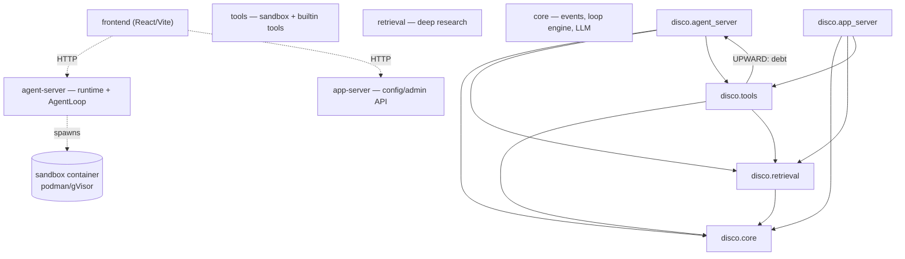

<!-- GENERATED by development/scripts/gen_arch_diagram.py — DO NOT EDIT. Re-run to refresh; the graph is derived from the checked context registry. -->

# Architecture — container & package dependency map

Solid arrows = Python import dependencies (auto-derived from the checked
context registry). Dotted = runtime (HTTP / sandbox spawn). A thick
`UPWARD` arrow marks a tracked layering violation (see `.importlinter`).
Layering + size are enforced by `lint-imports` and
`development/scripts/check_arch_budget.py`.

